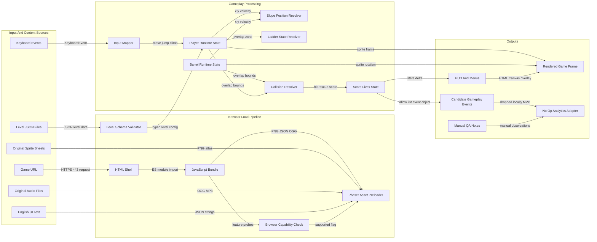
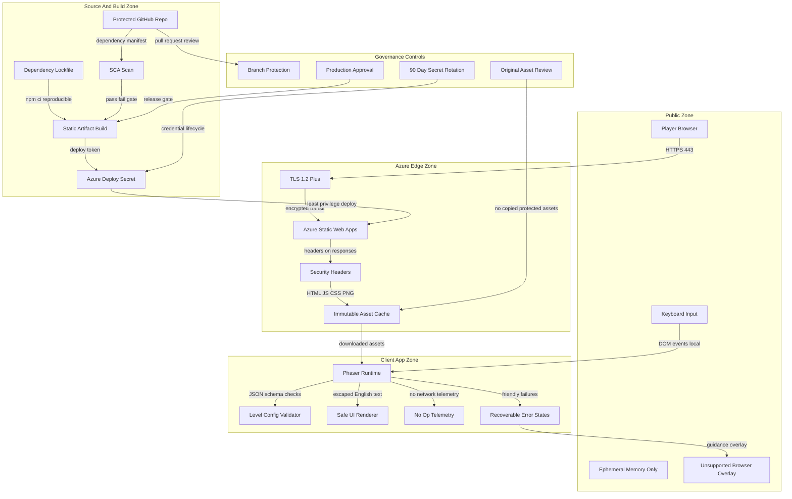
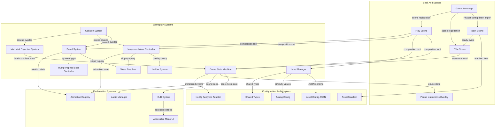
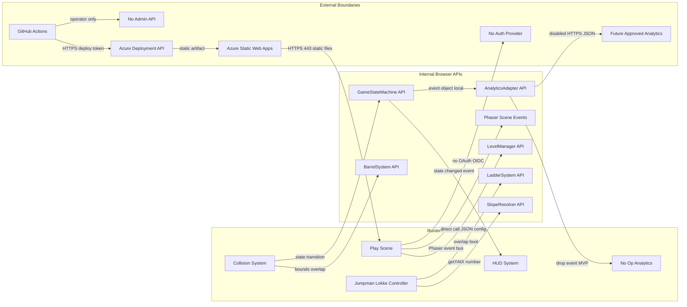

---

**Changelog** (2026-09-23T16:07:25.951Z): Architecture: 10 retained, 1 enhanced.

- Enhanced: Deployment Architecture

## Architecture Executive Summary

### Project Context
Donkey Trump is a new browser-based retro arcade platformer in the casual entertainment domain. The product serves casual retro arcade players who want instant play, Danish political satire fans who value the named caricature premise, completion-oriented arcade players who want learnable challenge, and a small creator/operator team that needs a low-maintenance web launch. The MVP is intentionally narrow: English-only UI, keyboard-first desktop browser play, 3–4 levels with increasing difficulty, score/lives, fail/retry, and a final victory screen. It explicitly excludes accounts, persistent profiles, multiplayer, native mobile apps, third-party analytics, an admin surface, copied Nintendo assets, and backend-heavy infrastructure.

### Architectural Philosophy
1. **Static-first delivery.** The proposed architecture uses Azure Static Web Apps backed by GitHub Actions because the game must load quickly, require no installation, and avoid server-side gameplay dependencies. This aligns with the target of first playable interaction within 5 seconds for at least 95% of supported-browser QA sessions.
2. **Client-side modular gameplay systems.** The Phaser 3 application is decomposed into scene management, player control, ladder climbing, slope handling, barrel spawning, collision handling, level progression, HUD, accessibility overlays, and a disabled analytics adapter. The goal is to avoid a single monolithic game scene while keeping runtime execution simple.
3. **Predictable arcade physics over physical realism.** Phaser 3 Arcade Physics is selected for lightweight platforming, while sloped girders, ladders, and barrel routing are implemented as explicit gameplay systems. This favors deterministic tuning and delivery speed over torque-accurate simulation.
4. **Privacy by omission.** The MVP collects no personal data, creates no accounts, stores no gameplay telemetry, and ships analytics disabled. An analytics interface may exist in code as a no-op adapter so future anonymous measurement can be added without touching gameplay modules.
5. **Secure supply chain despite simple hosting.** Even a static game needs dependency pinning, SCA scans, branch protection, signed or integrity-verified build artifacts, least-privilege deployment secrets, and security headers.

### Intent Alignment
The core architecture directly supports all nine intent features. Phaser 3 and Canvas/WebGL rendering support the browser game and retro sprite style. The player controller supports Jumpman Løkke movement, jump tuning, ladder climbing, hit states, and animation state transitions. Level definitions place Motzfeldt rescue zones at the top of each level and the Trump-inspired boss on the right side of its platform. A dedicated slope system keeps sloped girders isolated from the player and barrel code. A ladder system enforces overlap-only climbing and gravity suppression while climbing. A barrel system spawns hazards from the boss area, gives them right-to-left initial velocity, follows scripted or semi-random girder paths, visually rotates sprites, and triggers life loss through collision overlap. A game-state machine coordinates start, pause/instructions, play, level complete, life loss, game over, retry, and final victory.

### Architecture Decision Records
| Decision | Choice | Alternatives Considered | Rationale | Trade-offs |
|---|---|---|---|---|
| Runtime engine | Phaser 3 with Arcade Physics | Vanilla Canvas: smaller dependency but more custom collision and animation work. Matter.js: better slopes and circular physics but heavier and more complex tuning. | The requirements call for lightweight browser gameplay, keyboard controls, simple collision, ladders, barrels, sprite animation, and static hosting. Research indicates Arcade Physics is fast and well suited for classic 2D platformers, with slopes and ladders handled as custom systems. | Sacrifices true sloped collision, torque, and angular momentum. Requires a custom slope helper and scripted barrel routing. |
| Physics approach for slopes | Custom line-segment slope resolver plus visual sloped girders | Flat invisible bodies under sloped art: simplest but movement feels disconnected. Matter.js polygons: realistic but heavier and less predictable for arcade tuning. Stair-step blocks: easy but can jitter. | The MVP needs visible angled floors and reliable player/barrel movement, not physical realism. A line-segment slope resolver isolates the technical risk and keeps platform logic reusable across levels. | Requires careful edge-case handling at ladder tops, platform ends, and barrel drops. |
| Ladder mechanics | Overlap zones with a climbing state | Treat ladders as solid platforms: fails up/down climbing behavior. Full tile-engine ladder semantics: robust but more infrastructure. | Requirements state ladders are custom climb zones and Jumpman Løkke may climb only while overlapping. Gravity must be disabled or counteracted during climbing. | Adds a specialized state transition path to the player controller. |
| Barrel behavior | Scripted or semi-random Arcade Physics hazards with visual rotation | True rolling physics: more realistic but unnecessary. Fully deterministic barrels only: easier QA but less replay variation. | Requirements allow scripted or semi-random barrels and do not require torque. This supports learnable arcade patterns while preserving tuning flexibility. | Visual rotation is cosmetic and may not match exact physical distance unless tuned. |
| Hosting topology | Azure Static Web Apps deployed from GitHub Actions | Traditional VM: high operational overhead. Container app: unnecessary for static assets. Third-party game host: less control over CI and security gates. | The product is static-web-friendly, account-free, and has no backend runtime. Azure Static Web Apps provides CDN-backed delivery, TLS, preview environments, and simple GitHub deployment. | Azure platform dependency and limited server-side extension unless added later. |
| Analytics architecture | MVP no-op analytics adapter with no third-party analytics and no event submission | Third-party analytics: fast dashboards but violates launch decision. Self-hosted analytics: privacy-controlled but adds backend and operations. Browser local logs only: useful for QA but not product metrics. | The user explicitly selected no third-party analytics and analytics disabled in MVP. A no-op adapter keeps gameplay decoupled and supports QA/manual observation without data collection. | Product KPIs depending on analytics cannot be measured automatically until a future approved analytics implementation. |
| Auth and admin | No authentication, no player accounts, no admin UI | Player accounts: enables profiles but adds privacy and security scope. Admin portal: useful for operations but unnecessary at launch. | MVP requires no accounts, no persistent profiles, and no admin surface. Operators manage releases through GitHub and Azure. | No in-game personalization, identity-based leaderboards, or admin content editing. |
| Observability | No runtime observability platform for MVP, rely on QA and hosting health | Client error SDK: useful diagnostics but adds third-party or backend dependency. Azure Application Insights: strong telemetry but introduces runtime data collection. | The user selected no observability approach. The design instead emphasizes pre-release QA, static asset health, deployment gates, and manual smoke tests. | Production runtime errors are harder to detect automatically after launch. |

```mermaid

```

---

## System Architecture Overview

### Target System Shape
The proposed system is a static browser game architecture with no application server, no database, no authentication provider, and no in-product administration surface for the MVP. The runtime boundary is the player’s browser: Phaser 3 initializes the game, loads bundled JavaScript/CSS and original assets, executes the game loop locally, and maintains only ephemeral session state such as current level, score, lives, player position, and barrel objects. Azure Static Web Apps serves the compiled application over HTTPS on port 443, with CDN-style caching for immutable assets.

### Layer Responsibilities
| Layer | Responsibility | Key Architecture Choice |
|---|---|---|
| Player Device | Keyboard input, Canvas/WebGL rendering, audio, local game loop | Modern desktop browsers are the supported launch target; mobile/touch remains out of scope. |
| Static Delivery | HTML shell, JS bundle, CSS, sprites, audio, level JSON | Azure Static Web Apps with TLS, cache headers, and route fallback. |
| Client Runtime | Phaser scene lifecycle, Arcade Physics, collision/overlap handling | Runtime logic stays local to preserve responsiveness and avoid backend failure modes. |
| Game Systems | Player, ladders, slopes, barrels, boss, rescue objective, HUD, state machine | Modules are separated so slope risk and tuning changes do not spread through unrelated gameplay code. |
| Optional Interfaces | Disabled analytics adapter and QA/manual observation | No third-party analytics or runtime observability for MVP. |

### Why This Architecture
A server-rendered or API-backed architecture would add latency, deployment complexity, security surface, and privacy obligations without enabling the core arcade loop. The game is deterministic enough to run entirely in the browser, and the requirement to avoid accounts and persistent profiles removes the need for user storage. Azure Static Web Apps still provides production-grade delivery concerns: HTTPS, global static serving, preview environments, GitHub integration, and environment gates.

Performance budgets should be explicit. The title screen should become ready within 5 seconds in 95% of supported-browser QA sessions on broadband. Gameplay should sustain at least 45 FPS, with a design target of 60 FPS on typical desktop hardware. Initial payload should target under 5 MB compressed for the shell plus critical assets, with non-critical audio or large sprites deferred until after the title screen where possible. Input-to-action latency should remain under 100 ms for menu actions and under one frame, approximately 16–22 ms, for gameplay logic in normal conditions.

### Failure Boundaries
If static assets fail to load, the browser shell shows reload guidance. If audio is blocked or unavailable, gameplay continues with visual feedback. If analytics remains disabled, no gameplay path changes. If unsupported browser capabilities are detected, the system shows an English compatibility message rather than a broken canvas.

```mermaid
flowchart TD
  subgraph playerLayer["Player Device Layer"]
    playerUser["Player"]
    keyboardInput["Keyboard Input"]
    desktopBrowser["Modern Desktop Browser"]
    canvasRenderer["Canvas WebGL Renderer"]
  end
  subgraph deliveryLayer["Static Delivery Layer"]
    azureEdge["Azure Static Web Apps Edge"]
    tlsEndpoint["HTTPS TLS Endpoint"]
    cacheRules["Cache Header Rules"]
    staticAssets["Bundled JS CSS Assets"]
  end
  subgraph runtimeLayer["Game Runtime Layer"]
    phaserApp["Phaser 3 Game App"]
    arcadePhysics["Arcade Physics World"]
    sceneManager["Scene Manager"]
    gameState["Game State Machine"]
  end
  subgraph gameplayLayer["Gameplay Systems"]
    playerController["Jumpman Lokke Controller"]
    ladderSystem["Ladder Climb Zones"]
    slopeSystem["Slope Resolver"]
    barrelSystem["Barrel Hazard System"]
    bossSystem["Trump Inspired Boss"]
    rescueSystem["Motzfeldt Rescue Zone"]
    hudSystem["Score Lives HUD"]
  end
  subgraph operationsLayer["Operations Boundary"]
    githubRepo["GitHub Repository"]
    githubActions["GitHub Actions"]
    qaManual["QA Manual Observation"]
    analyticsNoop["Disabled Analytics Adapter"]
  end
  playerUser -->|"keyboard events local"| keyboardInput
  keyboardInput -->|"DOM KeyboardEvent"| desktopBrowser
  desktopBrowser -->|"HTTPS 443 GET"| tlsEndpoint
  tlsEndpoint -->|"TLS 1.2 plus"| azureEdge
  azureEdge -->|"immutable cache assets"| cacheRules
  cacheRules -->|"HTML JS CSS PNG OGG"| staticAssets
  staticAssets -->|"ES module bundle"| phaserApp
  phaserApp -->|"render frames"| canvasRenderer
  phaserApp -->|"scene lifecycle"| sceneManager
  sceneManager -->|"state transitions"| gameState
  gameState -->|"direct imports"| playerController
  playerController -->|"Arcade body velocity"| arcadePhysics
  playerController -->|"overlap checks"| ladderSystem
  playerController -->|"slope query per frame"| slopeSystem
  barrelSystem -->|"slope query per frame"| slopeSystem
  barrelSystem -->|"overlap damage"| playerController
  bossSystem -->|"spawn event"| barrelSystem
  rescueSystem -->|"level complete event"| gameState
  hudSystem -->|"score lives update"| gameState
  githubRepo -->|"push pull request release"| githubActions
  githubActions -->|"static artifact deploy"| azureEdge
  phaserApp -->|"no network events MVP"| analyticsNoop
  qaManual -->|"playtest notes"| githubRepo
```

---

## Data Flow Diagram

### Data Scope
The MVP has no server-side domain database and no player identity. The primary data flows are local runtime data: input events, level configuration, asset metadata, collision states, score/lives state, and temporary gameplay events. Because analytics is disabled for MVP, candidate gameplay events are validated and then dropped by a no-op adapter rather than transmitted. This keeps the product aligned with the explicit no-third-party-analytics decision while still allowing clean insertion of approved anonymous analytics later.

### Runtime Flow
At page load, the browser retrieves the HTML shell and the compiled application bundle from Azure Static Web Apps over HTTPS. Phaser’s preload phase loads sprite sheets, audio, UI text, and level JSON. The level loader validates structured level definitions before constructing platform segments, ladder zones, boss spawn locations, barrel path nodes, rescue zones, and HUD defaults. During gameplay, keyboard events are translated into player commands and passed into the player controller. The player controller, ladder system, slope resolver, barrel system, and collision system update local memory state every frame. The HUD subscribes to state changes for score, lives, level number, game-over, and victory feedback.

### Privacy and Retention
No personal data should enter the system. The architecture should treat all UI text and level configuration as public content, original art and source assets as internal intellectual property, and deployment credentials as restricted operational data. Candidate analytics payloads should be limited to an event name from an allow-list, level number, lives count, score band, input mode, and timestamp bucket; however, for MVP the adapter drops these events locally. If analytics is enabled in a future phase, raw anonymous events should be retained no longer than 13 months before purge or aggregation, and free-form fields, IP-derived identifiers, device fingerprinting, and persistent user IDs should remain prohibited.

### Failure Handling
Data-flow failures are intentionally local and recoverable. Asset load failure displays reload guidance. Invalid level JSON blocks the affected level and surfaces a friendly error state. Analytics adapter failure cannot block play because the MVP adapter performs no network call. Browser capability failure routes to an unsupported-browser overlay.



---

## Security Architecture

### Threat Model Summary
The MVP has a small runtime attack surface because it has no player login, no server-side game API, no database, no admin portal, and no payment flow. However, a static browser game still has meaningful security risks: supply-chain compromise, cross-site scripting through unsafe UI rendering or future configuration, asset tampering, overly permissive deployment credentials, misconfigured security headers, and accidental collection of identifying data if telemetry is enabled later.

### Security Zones
The public zone contains players and browsers. The edge delivery zone is Azure Static Web Apps over HTTPS. The source and build zone is GitHub plus GitHub Actions. The restricted operations zone contains deployment credentials and environment approvals. There is no internal application network and no data persistence zone for MVP gameplay. This is a deliberate simplification: security comes from reducing exposed services and enforcing safe delivery controls.

### Required Controls
| Control Area | Architecture Requirement |
|---|---|
| Transport security | HTTPS only, TLS 1.2 or higher, HSTS enabled where supported by hosting configuration. |
| Browser hardening | Content Security Policy, X-Content-Type-Options, Referrer-Policy, Permissions-Policy, and no debug endpoints in production. |
| Input and configuration validation | Level JSON, UI state transitions, and future analytics payloads must use allow-listed schemas and numeric bounds. |
| Privacy | No accounts, no persistent identifiers, no PII telemetry, no device fingerprinting, no third-party analytics in MVP. |
| Supply chain | Lockfile, dependency review, SCA, npm audit or equivalent, pinned actions, and protected production deployment. |
| Secrets | No secrets in source code. Azure deployment tokens must be stored as GitHub environment secrets, rotated at least every 90 days, and scoped to deployment only. |

### Trade-offs
The lack of runtime observability reduces operational visibility, but it also avoids telemetry data collection. The absence of accounts eliminates authentication risks, but it prevents identity-based personalization and leaderboards. The static architecture means most OWASP API risks are avoided for MVP, but XSS and supply-chain risks remain highly relevant because JavaScript executes in the player’s browser.



---

## Deployment Architecture

### Delivery Model
The deployment architecture uses GitHub Actions to build, test, scan, and deploy the static Phaser application to Azure Static Web Apps. This matches the user’s explicit platform decision and keeps the operations model consistent with a small static web game. The pipeline should be implemented as repository-owned workflow YAML, with the primary production workflow generated at `.github/workflows/static-web-app.yml`. The workflow should use three primary trigger paths: pull requests for validation and preview deployments, pushes to the main branch for staging deployment, and tagged releases for production deployment. The architecture does not use Forge’s built-in shipping engine as the release platform; GitHub Actions is the selected shipping platform.

### Pipeline Design
The workflow should separate validation, build, security scanning, preview deployment, staging deployment, production approval, and production deployment. Dependencies should be installed with a reproducible command such as `npm ci` using a committed lockfile. The runtime should be pinned to Node.js 22 LTS or the current approved LTS at implementation time. The validation job should run linting, type checking if TypeScript is adopted, unit tests for pure gameplay helpers, and accessibility/static checks for menus and overlays. The build job should create a static artifact and retain it for deployment. The scan job should run dependency review, SCA, and secret scanning. Azure Static Web Apps deployment should be performed from the workflow with the official Azure Static Web Apps deployment action, using a placeholder GitHub environment secret name such as `secrets.AZURE_STATIC_WEB_APPS_API_TOKEN`; no deployment token, real secret value, or environment-specific credential may be committed to the repository. Production deployment should require a GitHub Environment approval gate.

### Environments
| Environment | Trigger | Purpose | Gate |
|---|---|---|---|
| Preview | Pull request | Playable review build for stakeholder and QA checks | Automated validation required. |
| Staging | Push to main | Release candidate validation and smoke testing | Build and scan pass. |
| Production | Version tag or release | Public GA deployment | Manual approval and protected environment secret. |

### Concrete Targets
The build should complete in under 10 minutes for the MVP. Static artifact size should target under 20 MB uncompressed and under 5 MB compressed for critical startup resources. Deployment should complete in under 5 minutes after artifact creation. Production rollback should be possible within 15 minutes by redeploying the previous known-good artifact or previous release tag.

```mermaid
flowchart LR
  subgraph triggerLayer["Workflow Triggers"]
    pullRequest["Pull Request"]
    mainPush["Push To Main"]
    releaseTag["Release Tag"]
    manualRun["Manual Dispatch"]
  end
  subgraph validateJob["Validate Job"]
    checkoutCode["Checkout Code"]
    setupNode["Setup Node 22 LTS"]
    installDeps["NPM CI"]
    lintCode["Lint Source"]
    unitTests["Unit Tests"]
    a11yChecks["Menu Accessibility Checks"]
  end
  subgraph buildJob["Build Job"]
    buildGame["Build Phaser App"]
    bundleReport["Bundle Size Report"]
    packageArtifact["Package Static Artifact"]
    uploadArtifact["Upload Build Artifact"]
  end
  subgraph scanJob["Security Scan Job"]
    dependencyReview["Dependency Review"]
    scaAudit["SCA Audit"]
    secretScan["Secret Scan"]
    licenseCheck["License Check"]
  end
  subgraph deployLayer["Deployment Jobs"]
    previewDeploy["Deploy Preview Environment"]
    stagingDeploy["Deploy Staging Environment"]
    prodApproval["Production Approval Gate"]
    prodDeploy["Deploy Production Azure SWA"]
    smokeTest["Post Deploy Smoke Test"]
  end
  subgraph azureLayer["Azure Static Web Apps"]
    previewSlot["Pull Request Preview URL"]
    stagingSite["Staging Site"]
    productionSite["Production Site"]
    rollbackTag["Previous Release Tag"]
  end
  pullRequest -->|"github event"| checkoutCode
  mainPush -->|"github event"| checkoutCode
  releaseTag -->|"github event"| checkoutCode
  manualRun -->|"operator event"| checkoutCode
  checkoutCode -->|"repo contents"| setupNode
  setupNode -->|"node 22 cache"| installDeps
  installDeps -->|"lockfile deps"| lintCode
  lintCode -->|"pass fail"| unitTests
  unitTests -->|"pass fail"| a11yChecks
  a11yChecks -->|"needs validate"| buildGame
  buildGame -->|"dist folder"| bundleReport
  bundleReport -->|"size budget"| packageArtifact
  packageArtifact -->|"artifact zip"| uploadArtifact
  installDeps -->|"manifest lockfile"| dependencyReview
  dependencyReview -->|"vulnerability gate"| scaAudit
  scaAudit -->|"severity gate"| secretScan
  secretScan -->|"no secrets"| licenseCheck
  uploadArtifact -->|"artifact download"| previewDeploy
  uploadArtifact -->|"artifact download"| stagingDeploy
  uploadArtifact -->|"artifact download"| prodApproval
  licenseCheck -->|"scan pass"| previewDeploy
  licenseCheck -->|"scan pass"| stagingDeploy
  licenseCheck -->|"scan pass"| prodApproval
  previewDeploy -->|"Azure SWA token"| previewSlot
  stagingDeploy -->|"Azure SWA token"| stagingSite
  prodApproval -->|"environment approval"| prodDeploy
  prodDeploy -->|"HTTPS deploy"| productionSite
  prodDeploy -->|"version marker"| rollbackTag
  productionSite -->|"HTTPS 443 smoke"| smokeTest
  rollbackTag -->|"redeploy previous"| productionSite
```



---

## Component Architecture

### Module Boundaries
The Phaser codebase should be structured around gameplay responsibilities rather than screen-by-screen accumulation in a single scene file. The central principle is that each system owns one reason to change. Player feel tuning belongs in `PlayerController`. Ladder behavior belongs in `LadderSystem`. Sloped girder calculations belong in `SlopeResolver`. Barrel spawning and movement belong in `BarrelSystem`. Game progression belongs in `GameStateMachine` and `LevelManager`. This modularity is especially important because prior requirements identify sloped platform behavior as the main technical risk.

### Proposed Component Responsibilities
| Component | Responsibility | Design Notes |
|---|---|---|
| `GameBootstrap` | Create Phaser config, register scenes, configure Arcade Physics | Initial gravity can start near y 500 and be tuned by prototype. |
| `BootScene` | Capability checks, loading state, asset preloading | Shows visible loading after 2 seconds if needed. |
| `TitleScene` | Title, controls, instructions, start entry | English-only accessible menu controls. |
| `PlayScene` | Runtime orchestration for one active level | Coordinates systems rather than owning all logic. |
| `PlayerController` | Movement, reduced jump, climb entry, hit state, animations | Uses explicit states such as normal, jumping, climbing, hit, dead. |
| `LadderSystem` | Overlap zones, climb enter/exit, x snapping, gravity suppression | Ladders are not treated as ordinary platforms. |
| `SlopeResolver` | Line-segment girder math and y snapping | Used by both player and barrels. |
| `BarrelSystem` | Spawn timer, initial right-to-left velocity, route decisions, visual rotation | Supports scripted and semi-random tuning. |
| `BossController` | Trump-inspired boss placement and release animation triggers | Located on right side of boss platform. |
| `ObjectiveSystem` | Motzfeldt rescue zone and level-complete detection | At top of each level. |
| `HudSystem` | Score, lives, level, overlays, victory and retry copy | Must meet WCAG 2.1 AA for non-gameplay UI. |
| `AnalyticsAdapter` | No-op event sink for MVP | Interface accepts minimized events but does not send them. |

### Dependency Rules
Gameplay systems may depend on shared types and level configuration, but should not directly instantiate each other except through the scene composition root. The slope resolver should be a pure helper where possible so it can be unit tested with deterministic x/y cases. The level manager should load declarative level data, allowing the 3–4 MVP levels to vary difficulty through spawn intervals, barrel speed, ladder placement, platform spacing, and rescue position without code duplication.



---

## API Integration Architecture

### Integration Philosophy
The MVP should not introduce a gameplay backend or third-party analytics API. The primary integration boundary is static asset delivery: browsers request the app shell and bundled resources from Azure Static Web Apps over HTTPS. Inside the browser, modules communicate through typed in-memory interfaces, Phaser scene events, and explicit method calls. This is an important architectural point: most “APIs” in the MVP are internal module contracts rather than network endpoints.

### External Boundaries
There are three external boundaries. First, the browser downloads static content from Azure Static Web Apps. Second, GitHub Actions deploys the static artifact to Azure using an environment-scoped deployment secret. Third, future anonymous analytics may be enabled behind `AnalyticsAdapter`, but in MVP that adapter is a no-op and performs no HTTP calls. No player authentication provider, leaderboard service, profile service, payment provider, or operator admin API is present.

### Internal Contracts
Internal interfaces should still be treated as APIs because they control coupling. `LevelManager` exposes level definitions to `PlayScene`. `SlopeResolver` exposes deterministic functions such as `getYAtX` and `isWithinSegment`. `LadderSystem` exposes overlap and climb transition checks. `BarrelSystem` exposes spawn, update, route, and dispose operations. `GameStateMachine` publishes state changes for HUD and overlay rendering. `AnalyticsAdapter` accepts minimized candidate events but drops them locally in MVP.

### API Quality Rules
If a future backend is added, it must use versioned HTTPS endpoints, structured errors, proper status codes, schema validation, and server-side authorization. For MVP, these rules translate into strict internal validation: no free-form analytics fields, no arbitrary remote URLs, no dynamic script loading, and no unvalidated level JSON. The no-op adapter should return success synchronously or via a resolved promise within 1 ms to guarantee telemetry never blocks gameplay.



---

## Technology Stack Summary

### Stack Rationale
The proposed technology stack optimizes for a lightweight browser game, deterministic arcade mechanics, fast static delivery, and low operational overhead. Phaser 3 with Arcade Physics is the central runtime choice because it provides mature scene management, rendering, asset loading, animation, input, and simple collision systems without requiring a custom engine. JavaScript is acceptable because the stated project stack is JavaScript, HTML, and CSS; however, TypeScript is recommended if implementation flexibility allows, because strict typing materially reduces defects in level configuration, gameplay state transitions, and analytics payload schemas.

| Layer | Technology | Version | Status | Rationale |
|---|---|---:|---|---|
| Browser runtime | Modern Chromium, Firefox, Safari desktop browsers | Current stable and previous major | modern | Meets browser-based no-install requirement; desktop keyboard launch is in scope. |
| Game framework | Phaser 3 | Latest stable 3.x at implementation time | modern | Mature HTML5 2D framework with Canvas/WebGL rendering, scenes, input, animation, and Arcade Physics. |
| Physics | Phaser Arcade Physics | Bundled with Phaser 3 | acceptable | Fast and predictable for classic platformers; slope and ladder gaps are handled by custom systems. |
| Language | JavaScript | ES2022 or newer | acceptable | Matches requested stack; TypeScript is recommended for stricter maintainability if accepted. |
| Optional type layer | TypeScript strict mode | 5.x | modern | Recommended for schema safety, gameplay state modeling, and fewer null or undefined defects. |
| Markup | HTML5 | Living standard | modern | Provides static shell, canvas host, accessible fallback text, and unsupported-browser messaging. |
| Styling | CSS3 | Modern CSS | modern | Supports English UI overlays, focus states, contrast-compliant menus, and responsive shell layout. |
| Build tool | Vite | Latest stable 5.x or 6.x | modern | Fast local dev server and optimized static bundles suitable for Azure Static Web Apps. |
| Package manager | npm with lockfile | Latest bundled with Node 22 LTS | acceptable | Simple ecosystem fit; lockfile supports reproducible CI installs. |
| CI/CD | GitHub Actions | Hosted runners current | modern | Required by user; supports build, scan, approval, and Azure deployment workflow. |
| Hosting | Azure Static Web Apps | Managed service | modern | Fits static web delivery, TLS, preview environments, and GitHub-based deployment. |
| Analytics | No-op adapter | MVP disabled | modern | Preserves future extension point without collecting data or adding third-party scripts. |
| Runtime observability | None for MVP | Not applicable | acceptable | Explicit user decision; mitigated with QA gates and smoke tests. |
| Data storage | None for MVP | Not applicable | modern | No accounts, profiles, leaderboards, backend persistence, or telemetry storage. |

### Version and Upgrade Policy
Dependencies should be pinned through lockfiles and reviewed monthly during active development. Security patches for Phaser, Vite, Node, and GitHub Actions should be applied within 14 days for high severity and 7 days for critical severity. GitHub Actions should use pinned major versions at minimum, with SHA pinning considered for production hardening.

### Practical Implementation Note
If the team chooses plain JavaScript, strict linting and runtime schema validation become more important. If TypeScript is accepted, the architecture should model level definitions, player state, game states, event names, and collision categories as discriminated unions or equivalent typed structures. Either path must keep slope and ladder logic testable outside Phaser rendering where possible.

```mermaid

```

---

## Architectural Concerns & Recommendations

### Key Concerns
The most important architectural concerns are not database scale or distributed systems complexity; they are gameplay correctness, scope control, asset originality, privacy, accessibility, and secure delivery. The Phaser Arcade Physics slope limitation is the highest technical design risk because sloped girders are visually and mechanically central to the game. The analytics decision is another major architectural constraint: requirements originally discuss engagement metrics, but launch architecture must ship with analytics disabled and no third-party telemetry.

| # | Concern | Severity | Impact | Recommendation | Effort |
|---:|---|---|---|---|---|
| 1 | Sloped platform mechanics may feel unstable with Arcade Physics | High | Player or barrels may clip, float, jitter, or fail to follow visible girders, undermining the core Donkey Kong feel. | Build a vertical slice with one sloped girder, one ladder, one barrel, and one rescue zone before implementing all levels. Isolate line-segment slope math in `SlopeResolver`. | M |
| 2 | Analytics KPIs cannot be automatically measured in MVP | Medium | Level completion and victory-rate targets require manual playtest logs until an approved analytics phase. | Keep `AnalyticsAdapter` as a no-op and define a future anonymous event contract without enabling network calls. Use QA scorecards for launch decisions. | S |
| 3 | Sprite and audio asset originality risk | High | Copied protected assets could block launch and create legal or reputational risk. | Maintain an asset register with source, approval status, and replacement owner. Review all boss, player, rescue, barrel, platform, sound, and UI art before beta. | M |
| 4 | Difficulty tuning unresolved | Medium | Level 1 completion, retry engagement, and full-game victory rates may miss targets. | Store difficulty values in level/tuning config: barrel spawn interval, speed, ladder drop chance, lives, score values, and platform spacing. | M |
| 5 | Accessibility can be overlooked because real-time gameplay is visual | Medium | Menus, instructions, pause, retry, and victory overlays may fail keyboard or contrast expectations. | Treat non-gameplay UI as accessibility-critical. Define focus order, visible focus, high contrast, reduced motion options, and clear text. | M |
| 6 | No production observability | Medium | Runtime browser errors after GA may be underreported. | Accept as MVP constraint, strengthen pre-release browser matrix, smoke tests, and manual issue reporting. Revisit privacy-safe client diagnostics post-MVP. | S |
| 7 | Supply-chain compromise through npm or Actions | High | Malicious dependency or action could alter published game code. | Use lockfile, dependency review, SCA, secret scanning, protected branches, least-privilege Azure deployment secrets, and environment approvals. | M |
| 8 | Single-scene code growth | Medium | A large `PlayScene` could become hard to tune and test. | Enforce component boundaries and pure helper tests for slope, jump constants, level validation, and state transitions. | M |
| 9 | Unsupported browser or asset load failures | Low | Players may see a blank page instead of recoverable guidance. | Add capability checks, loading timeout messaging after 2 seconds, retry guidance, and audio-disabled fallback. | S |
| 10 | Future backend temptation | Low | Adding leaderboards or profiles would violate MVP privacy and scope. | Keep accounts, persistent profiles, admin UI, multiplayer, and leaderboard services explicitly out of launch architecture. | S |

### Recommendations
The first engineering milestone should be a mechanics vertical slice, not a full content build. This slice should prove jump height cannot bridge floors, ladder climbing works only in zones, barrels spawn right-to-left from the boss area, sloped y-position correction is stable, and the rescue zone transitions to level complete. The second milestone should expand level configuration and HUD/game states. Final hardening should focus on accessibility, asset review, security headers, CI gates, and cross-browser QA.

```mermaid

```

---

## Quality Attributes & NFR Matrix

### NFR Strategy
The quality attributes reflect a static browser game rather than a transactional SaaS system. Performance and responsiveness are the most player-visible qualities. Security and privacy are achieved primarily through scope minimization, static hosting, no identity, and no telemetry collection in MVP. Maintainability comes from modular gameplay systems and declarative level configuration.

| Attribute | Target | Current | Gap | Priority |
|---|---|---|---|---|
| Performance response time | Title screen ready within 5 seconds for at least 95% of supported-browser QA sessions; loading indicator after 2 seconds; menu actions respond within 100 ms. | New project baseline; no implementation yet. | Requires bundle budget, preloader design, cache headers, and browser matrix testing. | High |
| Performance frame rate | Maintain at least 45 FPS during normal gameplay, design target 60 FPS, with frame update budget under 16.7 ms at 60 FPS. | New project baseline; no implementation yet. | Requires sprite count limits, barrel object pooling, efficient collision checks, and no blocking analytics. | High |
| Throughput | Support at least 500 concurrent browser sessions from static hosting without gameplay degradation; static assets served via Azure edge. | New project baseline; no implementation yet. | Validate Azure Static Web Apps capacity and cache behavior before GA. | Medium |
| Availability uptime | Static site availability target 99.9% monthly for public game access, excluding planned Azure or DNS outages. | New project baseline; no implementation yet. | Requires Azure Static Web Apps configuration, rollback process, and release smoke tests. | Medium |
| Scalability data volume | MVP stores 0 player records and 0 gameplay telemetry records; future anonymous events target 10 events per session only if approved. | Analytics disabled by decision. | Automated KPI measurement deferred until future analytics architecture. | Medium |
| Security compliance level | TLS 1.2 or higher, security headers, dependency scanning, secret scanning, no committed secrets, no PII collection. | New project baseline; no implementation yet. | Must be enforced in CI and hosting configuration. | High |
| Privacy | No accounts, no profiles, no persistent identifiers, no third-party analytics, no telemetry submission in MVP. | Locked launch decision. | Privacy posture is strong but product analytics targets need manual measurement. | High |
| Accessibility | WCAG 2.1 AA target for menus, instructions, overlays, retry, game-over, and victory screens; 100% critical UI keyboard operable. | New project baseline; no implementation yet. | Requires design review, keyboard focus handling, contrast testing, and assistive smoke checks. | High |
| Maintainability | Gameplay systems separated by responsibility; slope, ladder, and game-state logic testable; level data declarative. | New project baseline; no implementation yet. | Requires module boundaries, lint rules, and test plan. | High |
| Disaster recovery | Redeploy previous release within 15 minutes; source repository remains system of record; RPO 1 hour or less for source and deployment metadata. | New project baseline; no implementation yet. | Requires release tags, artifact retention, protected branches, and documented rollback. | Medium |

### How the Architecture Achieves Targets
Static hosting removes server request latency from the gameplay loop. Phaser executes input, movement, collision, and rendering locally. Asset budgets and cache headers support the 5-second startup target. Object pooling for barrels and preloaded sprite sheets reduce runtime allocation spikes. No-op analytics ensures telemetry cannot block play. Security is enforced at build and delivery time rather than through a broad runtime backend. Accessibility is concentrated in the UI overlays where compliance is realistic and most relevant for launch.

```mermaid

```

---

## Operational Architecture

### Operating Model
The MVP operating model is intentionally lightweight. There is no live service tier to scale, no game database to back up, no account system to administer, and no runtime observability tool. Operations are centered on source control, CI/CD, static hosting configuration, release approvals, smoke testing, incident response through rollback, and manual QA feedback. This matches the low-operational-complexity business objective while still honoring secure delivery expectations.

### Release Operations
Each change flows through pull request validation, preview deployment, staging deployment, and production release. Preview URLs support stakeholder review and accessibility checks before merge. The staging environment validates release candidates against browser compatibility, load readiness, title/start flow, one-level playability, fail/retry, and victory path smoke tests. Production deployment requires approval through a protected GitHub Environment using an Azure deployment secret scoped only to static app deployment.

### Monitoring and Incident Response
The user selected no runtime observability approach for MVP. Therefore, the architecture should not add client telemetry, error SDKs, or analytics scripts. Instead, operational readiness depends on strong pre-release checks and simple rollback. Static site health can be checked by requesting the root HTML and key assets over HTTPS. A smoke test should verify that the title screen loads, level 1 starts, keyboard input moves Jumpman Løkke, a barrel collision triggers life loss, and the rescue zone completes a level. If a production issue is found, the operator redeploys the previous tagged artifact, with a rollback target of 15 minutes.

### Reliability Controls
Asset load failures and unsupported-browser states are handled in the client. Analytics failure is irrelevant in MVP because no analytics call is made. Audio failure should degrade to visual feedback. Deployment failure should fail closed: if scans, tests, or approvals fail, production is not updated. GitHub and Azure account access should require least privilege, MFA, and separation between code review and production approval where practical.

```mermaid
flowchart TD
  subgraph releaseOps["Release Operations"]
    developerChange["Developer Change"]
    pullRequest["Pull Request Review"]
    previewBuild["Preview Build"]
    stagingRelease["Staging Release"]
    prodApproval["Production Approval"]
    prodRelease["Production Release"]
  end
  subgraph qualityOps["Quality Gates"]
    lintGate["Lint Gate"]
    unitGate["Unit Test Gate"]
    accessibilityGate["Accessibility Gate"]
    securityGate["Security Scan Gate"]
    smokeGate["Browser Smoke Gate"]
  end
  subgraph hostingOps["Azure Static Hosting"]
    azurePreview["Azure Preview URL"]
    azureStaging["Azure Staging Site"]
    azureProd["Azure Production Site"]
    staticHealth["Static Health Check"]
    cachePurge["Cache Refresh"]
  end
  subgraph incidentOps["Incident And Recovery"]
    playerReport["Player Or QA Report"]
    issueTriage["Issue Triage"]
    rollbackDecision["Rollback Decision"]
    previousTag["Previous Release Tag"]
    rollbackDeploy["Rollback Deploy"]
  end
  subgraph noTelemetryOps["MVP No Telemetry"]
    noClientSdk["No Client Error SDK"]
    noAnalyticsRuntime["No Runtime Analytics"]
    manualQa["Manual QA Observation"]
    playtestChecklist["Playtest Checklist"]
  end
  developerChange -->|"git push"| pullRequest
  pullRequest -->|"PR event"| previewBuild
  previewBuild -->|"requires pass"| lintGate
  lintGate -->|"pass fail"| unitGate
  unitGate -->|"pass fail"| accessibilityGate
  accessibilityGate -->|"pass fail"| securityGate
  securityGate -->|"artifact approved"| azurePreview
  azurePreview -->|"stakeholder review"| stagingRelease
  stagingRelease -->|"release candidate"| azureStaging
  azureStaging -->|"HTTPS 443 checks"| smokeGate
  smokeGate -->|"pass fail"| prodApproval
  prodApproval -->|"protected environment"| prodRelease
  prodRelease -->|"deploy artifact"| azureProd
  azureProd -->|"GET root and assets"| staticHealth
  prodRelease -->|"refresh immutable index"| cachePurge
  azureProd -->|"manual issue"| playerReport
  playerReport -->|"triage notes"| issueTriage
  issueTriage -->|"severity high"| rollbackDecision
  rollbackDecision -->|"select prior version"| previousTag
  previousTag -->|"redeploy"| rollbackDeploy
  rollbackDeploy -->|"restore site"| azureProd
  noClientSdk -->|"no event collection"| noAnalyticsRuntime
  manualQa -->|"observations"| playtestChecklist
  playtestChecklist -->|"release findings"| issueTriage
```