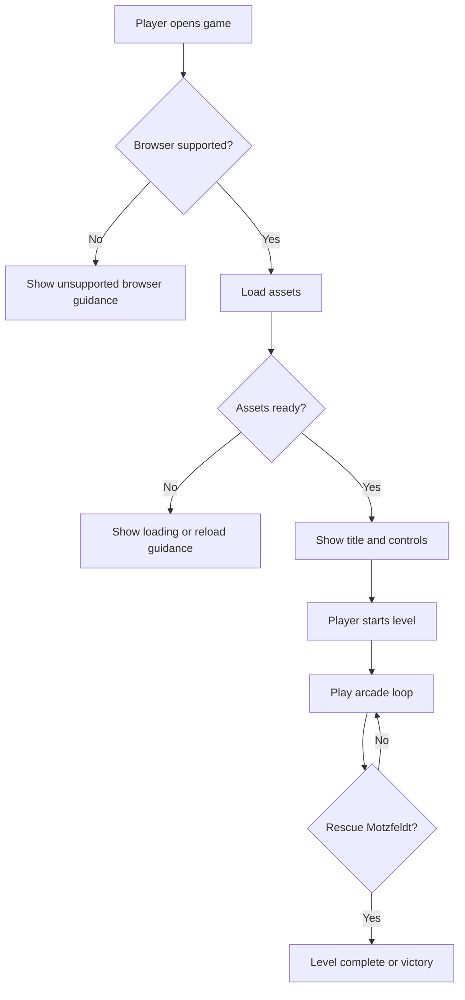
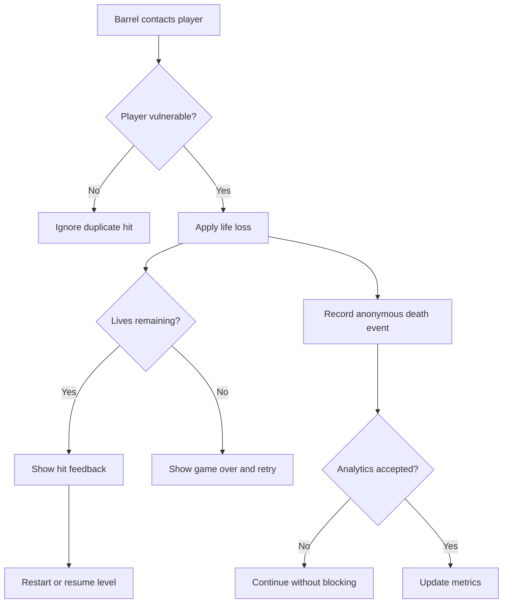
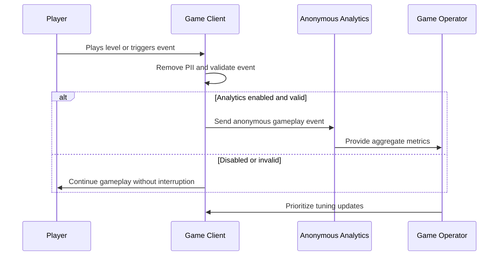
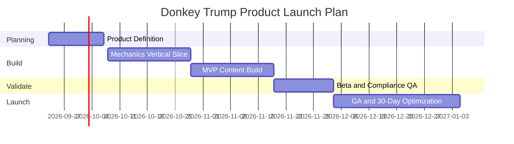

## Executive Summary

Donkey Trump is a new browser-based retro arcade platformer that combines instantly playable classic arcade mechanics with political satire. The opportunity is to deliver a lightweight, humorous game that appeals to casual web players and Danish political satire fans without requiring installation, accounts, or complex onboarding.

The product will let players control Jumpman Løkke as he climbs sloped platforms and ladders to rescue Motzfeldt while avoiding barrels released by a cartoonishly angry Donald Trump-inspired boss. The initial release will be a small complete game in English with 3–4 levels, increasing difficulty, score/lives, a victory screen, keyboard-first controls, and anonymous gameplay analytics only.

The primary value proposition is fast entertainment with a recognizable satire hook, nostalgic gameplay, and low operational complexity. Players benefit from a funny, accessible arcade experience; the game creator/operator benefits from a static-web-friendly product that can be launched, measured, and iterated without user accounts or backend-heavy infrastructure.

---

## Business Objectives and Success Criteria

| Objective | How the Product Delivers | Success Criteria | Measurement Method |
|-----------|--------------------------|------------------|--------------------|
| Launch a complete playable satire arcade experience | Delivers an English-only browser game with title screen, 3–4 levels, score/lives, fail/retry, and final victory screen | 100% of P0 gameplay stories accepted before GA; at least 3 playable levels completed in release candidate testing | Release acceptance checklist and playtest completion logs |
| Create an instantly accessible web game | Runs in modern desktop browsers with keyboard controls and no account requirement | First playable interaction available within 5 seconds on broadband desktop connections; at least 95% of test sessions can start a level without assistance | Browser QA runs and anonymous session-start analytics |
| Validate player engagement with the core loop | Uses anonymous analytics for sessions, deaths, input usage, level starts, level completions, and victory completions | At least 35% level-1 completion rate and at least 10% full-game victory completion rate within 30 days of GA [ASSUMPTION] | Anonymous gameplay event dashboard |
| Protect launch scope and reduce production complexity | Keeps launch static-web-friendly, account-free, and focused on keyboard-based arcade play | Zero account/profile features, zero multiplayer features, and zero native mobile deliverables in MVP | Scope review at each release gate |
| Meet accessibility and usability expectations for a browser game | Provides keyboard navigation, readable UI, reduced-motion consideration, contrast-compliant text, and clear error/failure feedback | WCAG 2.1 AA checklist passes for menus, instructions, overlays, and non-gameplay UI; 100% of critical UI actions operable by keyboard | Accessibility QA checklist and assistive technology smoke testing |

---

## Personas and Stakeholders

| Name | Type | Role | Goals | Pain Points | How Served |
|------|------|------|-------|-------------|------------|
| Casual Retro Arcade Player | Persona | End user seeking quick browser entertainment | Start playing quickly, understand controls, enjoy a short challenge, retry after failure | Low patience for setup, confusing controls, unfair difficulty spikes | Browser-first play, visible controls, tuned jump/ladder mechanics, clear score/lives feedback, immediate retry |
| Danish Political Satire Fan | Persona | End user attracted by caricature humor and topical parody | Recognize the satirical premise, enjoy the named characters, share a funny playable experience | Generic clones without satire, legal/IP concerns that dilute the parody | Original caricature-style art, named Jumpman Løkke and Motzfeldt, Trump-inspired boss, satire treated as core launch content |
| Completion-Oriented Arcade Player | Persona | Player who wants to beat the game and improve | Learn level patterns, preserve lives, improve score, reach the victory screen | Random-feeling hazards, unclear win condition, lack of progression | 3–4 increasingly difficult levels, consistent barrel rules, clear rescue objective, final victory screen |
| Game Creator/Operator | Stakeholder | Product owner and maintainer | Launch a lightweight browser game, measure anonymous engagement, update levels/assets later | Scope creep, unclear analytics, dependency on backend accounts | Static-web-friendly scope, anonymous analytics only, modular requirements for levels, hazards, and assets |
| Development and Art Team | Stakeholder | Implementation and asset delivery team | Build mechanics efficiently and produce original satire assets | Ambiguous physics expectations, risk of copyrighted asset use, unclear acceptance criteria | Phaser-oriented requirements, explicit no-Nintendo-assets rule, defined gameplay states and acceptance criteria |
| Compliance/Privacy Reviewer | Stakeholder | Reviews privacy, accessibility, and policy alignment | Ensure anonymous analytics, data minimization, accessibility, and safe content handling | Unclear data retention, accidental PII capture, inaccessible UI | Data classification rules, retention requirements, WCAG 2.1 AA targets, English-only launch scope |

---

## User Stories and Acceptance Criteria

| ID | As a... | I want to... | So that... | Priority | Acceptance Criteria |
|----|---------|-------------|-----------|----------|---------------------|
| US-001 | Player | open Donkey Trump in a modern browser and start a game | I can play immediately without installation | P0 | Given I open the game page, When assets and the title screen are ready, Then I see Donkey Trump and can start level 1 using keyboard input. Given asset loading is delayed, When loading exceeds 2 seconds, Then a visible loading state explains that the game is preparing. |
| US-002 | Player | control Jumpman Løkke left, right, and jump | I can avoid hazards and navigate platforms | P0 | Given a level is active, When I press left or right, Then Jumpman Løkke moves horizontally. Given he is grounded, When I press jump, Then he jumps to the tuned height. Given he is airborne, When I press jump again, Then no unintended double jump occurs unless explicitly enabled later. |
| US-003 | Player | climb ladders only when positioned on a ladder | I can progress vertically without bypassing level design | P0 | Given Jumpman Løkke overlaps a ladder zone, When I press up or down, Then he enters a climbing state and moves vertically. Given he is not overlapping a ladder zone, When I press up or down, Then he does not climb. Given he leaves the ladder or jumps away, Then normal gravity resumes. |
| US-004 | Player | reach Motzfeldt at the top of the level | I can complete each level through the rescue objective | P0 | Given Motzfeldt is positioned at the top objective area, When Jumpman Løkke reaches the rescue zone, Then the level-complete state triggers. Given there are remaining levels, When the completion state ends, Then the next level starts. Given the final level is completed, Then the victory screen appears. |
| US-005 | Player | face a Trump-inspired boss that releases barrels from the right | I experience the intended antagonist loop | P0 | Given a level starts, When the boss appears, Then the boss is positioned on the right side of its platform. Given the barrel timer triggers, When a barrel spawns, Then it begins moving from right to left from the boss area. |
| US-006 | Player | move along visibly sloped platform floors | the game feels like a classic girder platformer | P0 | Given a level is active, When I view the playfield, Then platforms are visibly angled rather than horizontal. Given Jumpman Løkke or a barrel is on a sloped segment, When it moves across the segment, Then its vertical position follows the intended slope behavior without falling through the floor. |
| US-007 | Player | rely on ladders rather than jumping floor-to-floor | the game preserves the intended challenge | P0 | Given two platform floors are vertically separated, When Jumpman Løkke performs the maximum-height jump, Then he cannot reach the next floor directly. Given a ladder connects the floors, When the player climbs it, Then vertical progression is possible. |
| US-008 | Player | lose a life or retry when hit by a barrel | hazards have clear consequences | P0 | Given a barrel overlaps Jumpman Løkke, When collision is detected, Then the game applies the configured life-loss/fail behavior. Given lives remain, When the hit state ends, Then the level restarts or resumes from the approved retry point. Given no lives remain, Then the game-over/retry state appears. |
| US-009 | Player | see score, lives, level status, and victory feedback | I understand progress and outcomes | P0 | Given gameplay is active, When score changes or lives change, Then the HUD updates within the same play state. Given the player completes all levels, When the final rescue occurs, Then a victory screen shows completion feedback and final score. |
| US-010 | Player using keyboard or assistive navigation | operate menus and essential non-gameplay UI by keyboard | I can start, pause, retry, and understand instructions accessibly | P0 | Given focus is on the game page, When I use keyboard navigation, Then start, instructions, pause, retry, and replay controls are reachable. Given text appears in menus or overlays, Then it meets WCAG 2.1 AA contrast requirements. |
| US-011 | Player | receive clear feedback when the browser cannot run the game correctly | I know what to do instead of seeing a broken page | P1 | Given the browser lacks required rendering or audio support, When the game initializes, Then a friendly unsupported-browser message appears. Given assets fail to load, When retries fail, Then the user sees a recoverable error state with reload guidance. |
| US-012 | Game Creator/Operator | collect anonymous gameplay analytics | I can evaluate engagement without player accounts or PII | P1 | Given a gameplay session starts, When anonymous analytics are enabled, Then events such as session start, death, level completion, victory, and input mode are recorded without names, emails, profiles, or persistent identity. Given analytics submission fails, Then gameplay continues without blocking the player. |

---

## Business Process Overview

### Process 1: Start and Play Session
The purpose of this process is to let a player move from browser arrival to active gameplay with minimal friction. The process emphasizes fast loading, clear controls, graceful failure, and no account requirement.

**Trigger event:** A player opens the Donkey Trump game page.

| Step | Participants | Data Inputs | Data Outputs | Decision / Exception |
|------|--------------|-------------|--------------|----------------------|
| 1. Open game page | Player, browser | Game URL, browser capabilities | Game shell request | If browser is unsupported, show compatibility message |
| 2. Load game assets | Browser, game client | Art, audio, level data, UI text | Ready or loading/error state | If assets fail, show reload guidance |
| 3. Show title and controls | Player, game client | English UI copy, control map | Start-ready state | If player does not start, remain on title/instructions |
| 4. Start level 1 | Player, game client | Start input | Active gameplay state, anonymous session event | If analytics fails, continue gameplay |
| 5. Play core loop | Player | Movement, jump, climb inputs | Position, score, lives, level progress | If hit by barrel, enter life-loss/retry process |
| 6. Complete objective | Player, game client | Rescue collision with Motzfeldt | Level complete or victory state | If final level is complete, show victory screen |

**Business outcome achieved:** The player reaches active gameplay quickly, understands what to do, and can complete a session without account setup.

### Process 2: Hazard, Life Loss, and Retry
The purpose of this process is to make barrel hazards meaningful while keeping retry friction low. It supports arcade challenge, score/lives feedback, and clear recovery after failure.

**Trigger event:** A barrel overlaps or collides with Jumpman Løkke during active gameplay.

| Step | Participants | Data Inputs | Data Outputs | Decision / Exception |
|------|--------------|-------------|--------------|----------------------|
| 1. Detect hazard contact | Game client | Player position, barrel position, current state | Hit event | If player is already invulnerable during respawn, ignore duplicate hit |
| 2. Apply consequence | Game client | Current lives, score, level | Updated lives/state | If lives remain, prepare retry; if none remain, show game over |
| 3. Communicate result | Player, game client | Hit/life state | Animation, sound/visual cue, message | If audio unavailable, visual feedback still appears |
| 4. Retry or game over | Player | Retry input, remaining lives | Restarted level or game-over state | If player exits, session ends gracefully |
| 5. Record anonymous event | Game client, analytics service if enabled | Death reason, level number, session token without PII | Anonymous death/retry event | If submission fails, gameplay remains unaffected |

**Business outcome achieved:** The game preserves challenge while giving players understandable consequences and rapid retries.

### Process 3: Anonymous Gameplay Measurement
The purpose of this process is to measure whether the game is engaging while preserving privacy and avoiding account complexity. Only anonymous gameplay events are collected.

**Trigger event:** A tracked gameplay event occurs, such as session start, level start, death, level completion, input usage, or victory.

| Step | Participants | Data Inputs | Data Outputs | Decision / Exception |
|------|--------------|-------------|--------------|----------------------|
| 1. Event occurs | Player, game client | Gameplay action and level state | Candidate analytics event | If analytics is disabled, no event is sent |
| 2. Minimize event payload | Game client | Event type, level, score band, lives count, input type | Anonymous event | PII fields are excluded by policy |
| 3. Validate event | Game client or analytics receiver | Allowed event names and numeric bounds | Accepted or rejected event | Invalid events are discarded without affecting play |
| 4. Store aggregate data | Analytics service/operator | Anonymous event | Aggregated dashboard metrics | Retention rules purge aged raw events |
| 5. Review outcomes | Game creator/operator | Completion, death, session metrics | Tuning decisions | If metrics show high drop-off, prioritize difficulty tuning |

**Business outcome achieved:** The operator can improve level tuning and engagement using minimized, anonymous data.

---

## Business Rules and Policies

| Rule | When It Applies | User Experience | Example |
|------|-----------------|-----------------|---------|
| English-only launch content | Any menu, instruction, HUD label, error message, victory text, or analytics consent/notice text appears | Players see all launch UI text in English; no partial multilingual experience is promised | If a help overlay explains controls, it says “Use arrow keys to move and climb” in English only; later localization is a future consideration |
| Satire and named caricatures remain core | Character naming, art direction, title presentation, level narrative, and marketing copy are created | The game uses original caricature-style depictions of Jumpman Løkke, Motzfeldt, and a Donald Trump-inspired boss | If an asset resembles copyrighted Donkey Kong/Nintendo material too closely, it is rejected and replaced with original art while preserving the satire premise |
| No copyrighted Donkey Kong/Nintendo assets | Any art, sound, level design, naming, or promotional material is reviewed | Players experience nostalgic inspiration without copied protected assets | A barrel hazard may be visually arcade-like, but sprites, music, names, and level assets must be original |
| Ladder-only vertical progression | Player movement is tuned for every level | Jumping helps avoid barrels but does not bypass ladders | If testing shows Jumpman Løkke can jump directly from one floor to the next, jump height or platform spacing must be adjusted before release |
| Ladder interaction requires ladder overlap | The player presses up/down | Climbing starts only inside ladder zones, with clear movement behavior | Pressing up in open space does nothing; pressing up while overlapping a ladder starts climbing |
| Barrels begin from the boss area and move right-to-left initially | A barrel is spawned during active gameplay | Players can anticipate the boss threat and learn patterns | The boss on the right releases a barrel that first travels left before following the level path |
| Anonymous analytics only | Gameplay events are measured | Gameplay continues without login, profile creation, or identity collection | A death event records level number and cause category, not player name, email, IP-derived profile, or persistent user identity |
| Analytics must not block gameplay | Analytics submission is slow, unavailable, rejected, or disabled | Players continue playing without interruption | If a level-complete event cannot be sent, the next level still loads and the failure is handled silently from the player perspective |
| Data minimization and retention | Gameplay analytics are stored or reviewed | Only aggregate or anonymous operational metrics are retained for product improvement | Raw anonymous gameplay events are retained for no more than 13 months [ASSUMPTION], then purged or aggregated |
| Accessibility for non-gameplay UI | Title screen, pause screen, instructions, retry, game-over, and victory screen are used | Essential UI is keyboard-operable, readable, and screen-reader understandable where practical | The retry button is reachable by keyboard and has a clear accessible name |
| Performance guardrails | The player loads or plays the browser game | The game feels responsive and avoids avoidable lag | If frame rate drops below 45 FPS on supported desktop browsers during normal play, release is blocked until optimized |
| Input validation and safe output | Any user-provided value, configuration, or analytics payload is processed | Invalid or unexpected data is rejected safely without exposing technical details | If an analytics event name is not on the allow-list, it is discarded and does not appear in dashboards |

---

## Success Metrics and KPIs

### Primary Metrics
| Metric | Target | Measurement Method | Timeline | Business Impact |
|--------|--------|--------------------|----------|-----------------|
| MVP acceptance completion | 100% of P0 user stories accepted | Product acceptance checklist | Before GA | Confirms the launch game is complete and playable |
| Level 1 completion rate | At least 35% of anonymous sessions complete level 1 [ASSUMPTION] | Anonymous level completion analytics | Within 30 days after GA | Indicates the game is understandable and not overly punishing |
| Full-game victory completion rate | At least 10% of anonymous sessions reach the victory screen [ASSUMPTION] | Anonymous victory event analytics | Within 30 days after GA | Validates 3–4 level difficulty progression |
| Retry engagement | At least 25% of players who lose all lives start another run [ASSUMPTION] | Anonymous retry event analytics | Within 30 days after GA | Measures whether failure feels fair enough to replay |

### Secondary Metrics
| Metric | Target | Measurement Method | Timeline | Business Impact |
|--------|--------|--------------------|----------|-----------------|
| Median session duration | 3–8 minutes [ASSUMPTION] | Anonymous session timing | Within 30 days after GA | Confirms a short arcade session length suitable for browser play |
| Control discovery | At least 90% of sessions record movement input within 10 seconds of level start | Anonymous input usage analytics | Beta and GA | Confirms instructions and controls are clear |
| Level progression balance | Death rate increases by no more than 25 percentage points between adjacent levels [ASSUMPTION] | Anonymous deaths by level | During beta | Helps tune increasing difficulty without severe spikes |
| Asset readiness | 100% of launch characters and hazards use original approved assets | Asset review checklist | Before beta | Reduces IP and content launch risk |

### Guardrail Metrics
| Metric | Target | Measurement Method | Timeline | Business Impact |
|--------|--------|--------------------|----------|-----------------|
| Game load readiness | 95% of supported-browser sessions reach title screen within 5 seconds | Browser performance monitoring and QA | Beta and GA | Protects instant-play value proposition |
| Runtime stability | Fewer than 1% of sessions encounter a fatal game error | Client error monitoring without PII | GA + 30 days | Protects player trust and shareability |
| Gameplay responsiveness | Maintain at least 45 FPS during normal gameplay on supported desktop browsers | Performance QA | Before GA | Protects arcade feel and fairness |
| Analytics privacy | 0 known PII fields collected in analytics events | Payload review and privacy QA | Before beta and before GA | Maintains account-free privacy posture |
| Accessibility compliance | 100% of critical menus and overlays pass WCAG 2.1 AA checks | Accessibility QA | Before GA | Reduces exclusion and policy risk |

---

## Risks Assumptions Dependencies and Constraints

### Risks
| Risk | Probability | Business Impact | Trigger Conditions | Mitigation | Owner |
|------|-------------|-----------------|-------------------|------------|-------|
| Satirical content is too narrow or controversial | Medium | May reduce broad appeal or create reputational concerns | Negative feedback during beta or stakeholder review | Keep satire core but use original caricature art, clear parody framing, and avoid copied protected assets | Product Owner |
| Sloped platform behavior is harder than expected in Phaser Arcade Physics | Medium | Could delay core gameplay or make barrels/player movement feel unfair | Player or barrels clip, float, or fail to follow slopes during prototype | Isolate slope behavior into a dedicated helper and validate with one vertical slice before full level build | Engineering Lead |
| Difficulty progression is too punishing | Medium | Players may abandon before reaching later levels or victory screen | Level 1 completion below 35% or sharp death-rate spike between levels | Use beta analytics to adjust barrel spawn rate, platform spacing, jump tuning, and lives | Product Owner + Game Designer |
| Asset production delays | Medium | Launch could slip or use placeholder art too long | Original character sprites, animations, or UI art not ready by beta | Define minimum asset list, review early sketches, and allow temporary internal placeholders only before beta | Art Lead |
| Accessibility expectations conflict with real-time arcade gameplay | Low | Some users may find gameplay difficult even if menus are accessible | Keyboard-only or assistive testing identifies barriers in critical UI | Ensure menus/overlays meet WCAG 2.1 AA and provide clear instructions, pause, retry, and reduced-motion options where feasible | Product Owner + QA |
| Anonymous analytics implementation accidentally captures identifying data | Low | Privacy review failure and trust risk | Payload review finds free-form fields, persistent identifiers, or personal data | Use event allow-list, exclude free text, avoid accounts, and validate payloads before beta | Engineering Lead + Privacy Reviewer |

### Assumptions
| Assumption | Impact if Wrong | Validation Plan |
|------------|-----------------|-----------------|
| [ASSUMPTION] Phaser 3 with Arcade Physics is sufficient for MVP rather than Matter.js | If false, slope and barrel behavior may require rework or a heavier physics approach | Build a prototype with one sloped platform, one ladder, and one barrel before full production |
| [ASSUMPTION] Desktop keyboard play is acceptable for launch; mobile/touch is not required | If false, launch reach may be limited and touch controls may become a P0 feature | Confirm target device expectations with sponsor before beta |
| [ASSUMPTION] Anonymous analytics can be implemented with minimal backend or a privacy-safe third-party tool | If false, measurement scope may need reduction or additional infrastructure | Select analytics approach during architecture planning and complete privacy review |
| [ASSUMPTION] 3–4 levels are enough to satisfy the “small complete game” expectation | If false, perceived value may be lower than expected | Validate during beta playtests and review completion/retry metrics |
| [ASSUMPTION] Original caricature assets can be produced in time for beta | If false, beta may need placeholder visuals or timeline adjustment | Approve art direction and minimum asset list before implementation sprint 2 |

### Dependencies
| System/Team | Dependency | Timeline | Impact if Delayed |
|-------------|------------|----------|-------------------|
| Product Owner | Final approval of game tuning defaults, scoring, lives, and retry rules | By 2026-10-07 | Delays level balancing and acceptance testing |
| Art Team | Original caricature sprites, boss, rescue target, barrels, platforms, UI art | By 2026-10-21 | Delays beta readiness and content review |
| Engineering Team | Phaser 3 game scaffold, physics prototype, level system, analytics events | 2026-09-30 to 2026-11-04 | Delays all playable milestones |
| QA/Accessibility | Browser, gameplay, performance, and WCAG 2.1 AA testing | 2026-11-05 to 2026-11-19 | Delays beta-to-GA decision |
| Privacy/Compliance Reviewer | Anonymous analytics payload and retention review | By 2026-11-12 | Blocks analytics launch or requires instrumentation changes |
| Hosting/Operations | Static web hosting, deployment workflow, monitoring | By 2026-11-19 | Delays beta distribution and GA launch |

### Constraints
| Constraint | Type | Impact |
|------------|------|--------|
| Launch UI is English only | Business | Reduces localization scope and avoids multilingual QA for MVP |
| Anonymous gameplay analytics only | Regulatory | Prohibits accounts, profiles, leaderboards tied to identity, and PII capture in MVP |
| 3–4 levels with increasing difficulty, score/lives, and victory screen | Business | Defines MVP completeness and prevents single-level demo scope |
| Static-web-friendly browser deployment | Technical | Encourages lightweight architecture and limits backend dependency |
| Phaser Arcade Physics does not natively support true slopes | Technical | Requires custom slope logic, stepped collision, invisible bodies, plugin, or Matter.js decision |
| Ladders are custom climb zones, not ordinary platforms | Technical | Requires explicit climbing state and overlap behavior |
| Original caricature assets only; no copied Donkey Kong/Nintendo assets | Regulatory | Requires art/content review and original asset production |
| No native mobile app, multiplayer, accounts, or persistent profiles in MVP | Business | Keeps launch focused and reduces delivery risk |

---

## Scope NFRs and Open Questions

### In Scope
- Browser-based arcade platformer titled Donkey Trump.
- English-only launch UI, instructions, HUD, error states, and victory text.
- Jumpman Løkke as the playable character with movement, jumping, ladder climbing, hit/fail behavior, and original caricature-style art.
- Motzfeldt rescue objective at the top of each level.
- Donald Trump-inspired angry boss character positioned on the right side and releasing barrels right-to-left.
- 3–4 levels with increasing difficulty.
- Visibly sloped platform floors using an approved technical workaround.
- Reduced jump height that prevents floor-to-floor jumping and requires ladder-based vertical progression.
- Barrel hazards with visual rotation, collision/overlap damage, and scripted or semi-random movement.
- Start/play, pause/instructions, level complete, life loss, game over/retry, and final victory states.
- Score/lives display and anonymous gameplay analytics events for sessions, deaths, level completion, input usage, and victory.

### Out of Scope
- Direct use of copyrighted Donkey Kong/Nintendo names, sprites, music, sounds, or level assets.
- Native mobile applications.
- Online multiplayer.
- Backend player accounts, persistent profiles, identity-based leaderboards, or social login.
- Physically realistic barrel torque simulation unless Matter.js or custom physics is explicitly selected later.
- Launch localization beyond English.
- Payment, subscriptions, or commerce features.

### Future Consideration
- Mobile and touch controls.
- Additional levels, alternate layouts, difficulty modes, or challenge modes.
- Public leaderboard using privacy-safe design.
- More advanced animations, sound design, and accessibility options.
- Matter.js migration or hybrid physics if slope/rolling fidelity becomes a higher priority.
- Localization into Danish or other languages.

### Non-Functional Requirements
- **Performance:** Supported desktop browsers must reach title screen within 5 seconds for at least 95% of QA sessions; normal gameplay should maintain at least 45 FPS; critical menu interactions should respond within 100 ms; anonymous analytics submission must not block gameplay and should fail gracefully.
- **Security:** No player accounts or authentication are required for MVP. Any analytics or configuration payloads must use allow-listed fields, reject unexpected event names, avoid free-form personal text, and avoid exposing technical errors to players.
- **Accessibility:** Menus, instructions, pause, retry, game-over, and victory screens must target WCAG 2.1 AA, including keyboard operability, visible focus, readable contrast, screen-reader-friendly labels where practical, and no critical information conveyed by color alone.
- **Scalability:** Static game assets should be cacheable and deployable through standard static hosting/CDN. [ASSUMPTION] MVP should support at least 500 concurrent browser sessions without gameplay degradation when served from static hosting; analytics ingestion capacity should support at least 10 events per session on average.
- **Compliance:** GDPR/CCPA-style privacy principles apply to analytics minimization and retention even without accounts. PII must not be collected; anonymous raw event retention should be capped at 13 months [ASSUMPTION] before purge or aggregation. SOC 2/ISO 27001-style audit expectations apply to operational changes and access to analytics dashboards if such tools are used.
- **Internationalization:** Launch is English only. UI text should still be centralized where practical so future localization can be added without redesigning gameplay.
- **Reliability and Error Handling:** Asset load failure, unsupported browser, analytics failure, and gameplay state errors must produce clear user-facing recovery paths or graceful degradation.

### Open Questions
- Product Owner: Should levels use unique layouts, a repeated classic structure with variations, or a hybrid approach?
- Product Owner/Game Designer: What exact scoring model should be used for level completion, barrel avoidance, remaining lives, and time bonuses?
- Product Owner/Game Designer: How many lives should the player start with, and should continues reset score or preserve progress?
- Product Owner/Engineering Lead: Should the implementation commit to Phaser Arcade Physics with custom slope logic, or prototype Matter.js before final selection?
- Art Lead/Product Owner: Will final caricature assets be supplied externally or created by the implementation team?
- Product Owner: Is desktop keyboard-only launch sufficient, or should mobile/touch support move into MVP?
- Privacy Reviewer: What analytics provider or self-hosted approach is approved for anonymous event collection and retention?

---

## Rollout Plan

1. **Phase 1 — Product Definition and Prototype Planning**
   - **Timeline:** 2026-09-23 to 2026-10-07
   - **Description:** Finalize MVP tuning decisions, asset list, level approach, analytics event list, and technical prototype plan.
   - **Key milestones and deliverables:** Approved PRD-Spec, scoring/lives decision, minimum asset checklist, analytics event allow-list, browser support matrix.
   - **Dependencies:** Product Owner, Engineering Lead, Art Lead, Privacy Reviewer.
   - **Success gates:** All P0 open questions either answered or explicitly accepted as [ASSUMPTION]; prototype scope approved.
   - **Owner:** Product Owner.

2. **Phase 2 — Mechanics Vertical Slice**
   - **Timeline:** 2026-10-08 to 2026-10-28
   - **Description:** Build a playable slice with one level segment covering movement, jump tuning, ladder climbing, slope behavior, boss barrel spawn, collision, life loss, and retry.
   - **Key milestones and deliverables:** Playable prototype, slope workaround validated, ladder state validated, initial barrel pathing, preliminary HUD.
   - **Dependencies:** Engineering Team and initial placeholder or draft art.
   - **Success gates:** Jumpman Løkke cannot jump floor-to-floor; ladder climbing works only in ladder zones; barrels spawn right-to-left and trigger life loss; prototype maintains at least 45 FPS in QA.
   - **Owner:** Engineering Lead.

3. **Phase 3 — MVP Content Build**
   - **Timeline:** 2026-10-29 to 2026-11-18
   - **Description:** Expand the vertical slice into the complete 3–4 level game with increasing difficulty, score/lives, victory screen, original caricature assets, and anonymous analytics instrumentation.
   - **Key milestones and deliverables:** All levels implemented, final character/boss/rescue/barrel/platform assets integrated, score/lives HUD, game-over/retry flow, victory screen, analytics events.
   - **Dependencies:** Art Team asset delivery, Product Owner tuning decisions, Privacy Reviewer analytics approval.
   - **Success gates:** 100% of P0 user stories pass internal acceptance; no copied Nintendo assets; analytics payload contains no PII.
   - **Owner:** Product Owner with Engineering Lead.

4. **Phase 4 — Beta Playtest and Compliance QA**
   - **Timeline:** 2026-11-19 to 2026-12-03
   - **Description:** Run beta playtests to validate difficulty, usability, performance, accessibility, privacy, and stability.
   - **Key milestones and deliverables:** Beta build, playtest report, accessibility checklist, performance report, privacy review sign-off, prioritized tuning backlog.
   - **Dependencies:** QA/Accessibility, Privacy Reviewer, beta participants.
   - **Success gates:** Level 1 completion at or above 35% in beta [ASSUMPTION]; fatal game error rate below 1%; critical UI passes WCAG 2.1 AA checks; title screen load target met in supported browsers.
   - **Owner:** QA Lead and Product Owner.

5. **Phase 5 — General Availability Launch and 30-Day Optimization**
   - **Timeline:** 2026-12-04 to 2027-01-04
   - **Description:** Launch the static web game, monitor anonymous metrics, correct critical issues, and tune difficulty based on early data.
   - **Key milestones and deliverables:** GA release, public play link, monitoring dashboard, launch notes, 30-day KPI report, prioritized post-launch roadmap.
   - **Dependencies:** Hosting/Operations, Product Owner, Engineering support.
   - **Success gates:** Game remains playable in supported browsers; analytics confirms event collection without PII; 30-day KPI review completed with go/no-go decisions for future enhancements.
   - **Owner:** Game Creator/Operator.

